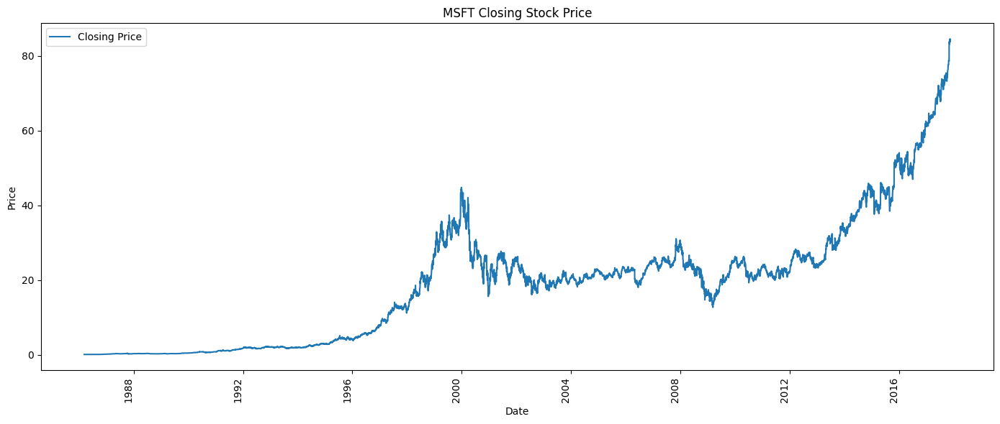
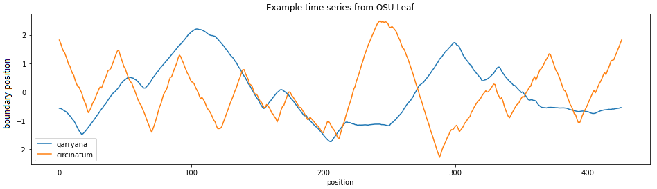
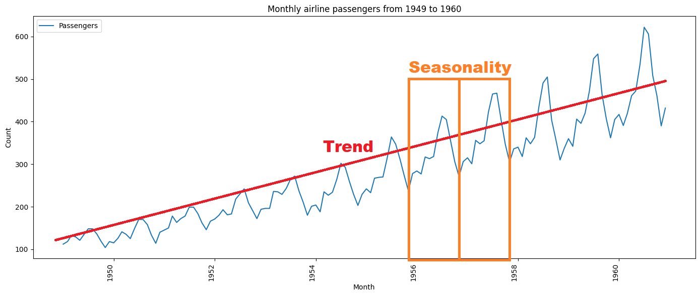
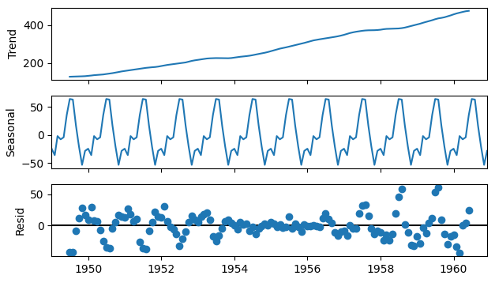
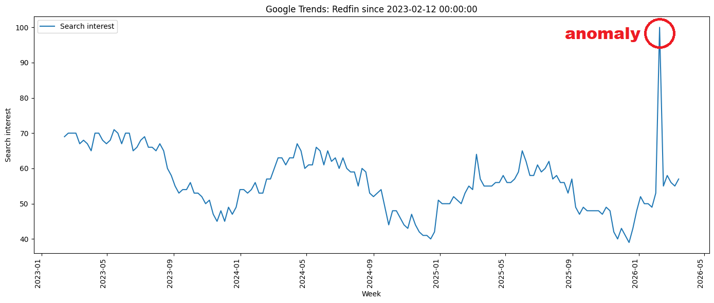
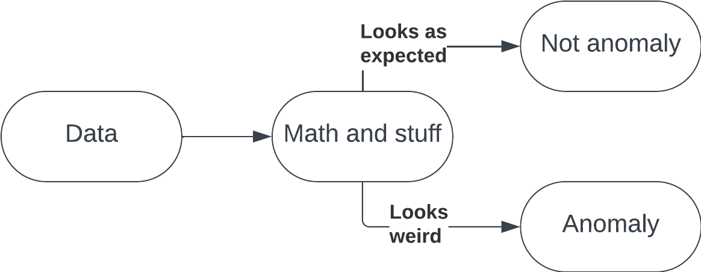
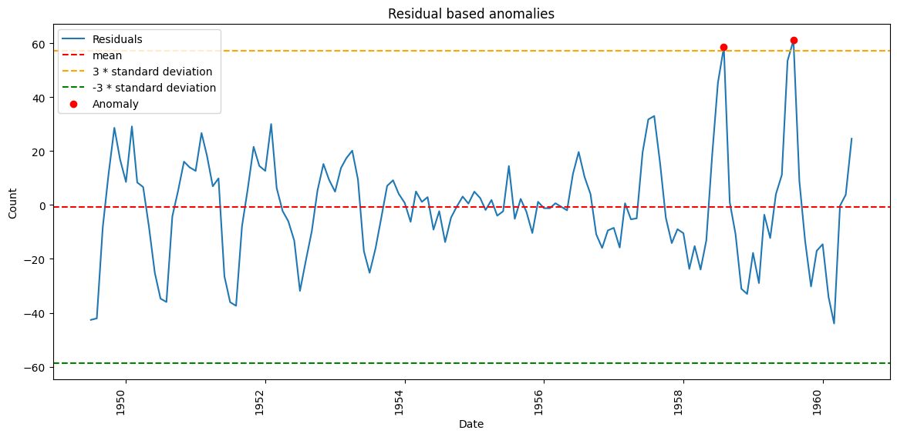
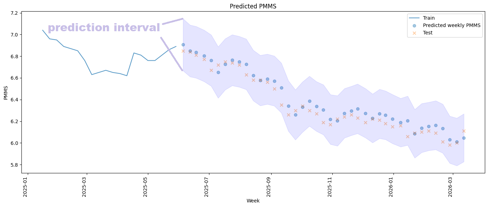
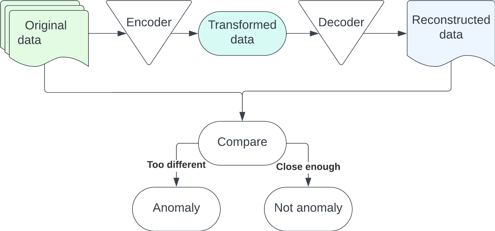

# Time Series Anomaly Detection
This is a repository dedicated to sharing easy to use anomaly detection methods for time series data.

Warnings:
- Tensorflow (required to run the LSTM based method) only works with Python 3.9–3.12.
- Many time series models assume the data is stationary. In this repository, we skipped these standard checks in favor of simplicity and focusing on the anomaly detection methods.
## Abstract
Anomaly detection for time series data has a variety of applications ranging from fraud alerting to identifying health concerns. We cover a high level introduction to time series data, univariate time series models, and time series anomaly detection. We provide examples with code for some methods of using time series models for anomaly detection in a variety of situations. 
## Contents
- **arima_anomaly_detection.ipynb**: Simple example of using an ARIMA model for anomaly detection in simulated model outputs.
- **ensemble_anomaly_detection.ipynb**: Example of using ensembled time series models for anomaly detection with google trends data.
- **lstm_autoencoder.ipynb**: Example using an LSTM autoencoder for anomaly detection.
- **seasonal_decompose_temperature.ipynb**: Example using seasonal decompose for anomaly detection.
- **seasonal_decompose_airline_passengers.ipynb**: Example using seasonal decompose for anomaly detection.
- **temperature_data.csv**: Data used for seasonal_decompose_temperature.ipynb
- **google_trends_redfin.csv**: Data used for ensemble_anomaly_detection.ipynb
- **pmms_data.csv**: Data used for arima_anomaly_detection.ipynb
- **requirements.txt**: requirements file
## Prerequisite knowledge
### Time series data
A time series $Y = \{y_1, y_2, ..., y_n\}$ is a set of observations $y_t$ recorded at time $t$. They can be univariate or multivariate, discrete or continuous. Time series can be used in regression (e.g. forecasting stock prices) or classification (e.g. identifying a cardiac event). This repository focuses on using forecasting models for anomaly detection in the discrete univariate case.

An example of time series for regression: Microsoft closing stock price.

An example of time series for classification: the leaf shape from two different species of tree.

Time series can be thought of as containing three components: 
1. Trend $(t_t)$: the general shape of the data over time
2. Seasonality $(s_t)$: Patterns based on time
3. Noise/residuals $(\epsilon_t)$: Random noise assumed to be normally distributed

Time series can be additive:

$x_t = t_t+s_t+\epsilon_t$

Or multiplicative:

$x_t = t_ts_t\epsilon_t$

We can decompose a time series into the three parts, which can give us insight into how to treat the time series for modeling and, of course, anomaly detection.

### Anomaly detection
Anomaly is sometimes used interchangably with outliers, and frequently the same methods can be used to find either. However, they are distinct concepts. Outliers are data points that significantly deviate from the majority of the data set, with uses cases such as data cleaning or explaining a statistic. Anomalies are events in the data that do not fit the expected behavior which help identify significant events like fraud or a heart attack. Anomaly detection is the automated identification of anomalies frequently utilizing machine learning methods.

In this image it is easy to visually inspect the plot and find an obvious anomaly in February 2026. Not all anomalies are this easy to spot.

Anomaly detection at its core is a simple concept. It's the "math and stuff" part where we have the opportunity to make things complicated and fun.

### Time series decomposition

By decomposing a time series into trend, seasonality, and residuals, we can take advantage of the properties of the residuals. We assume that the residuals are normally distributed which can make it easy to identify anomalies. For example, any residual outside of 3 standard deviations of the mean could be classified as an anomaly. Then, based on the date index of the residuals, we can find the anomalies in the data.

### Prediction intervals
Many of the techniques included in this repository rely on the use of prediction intervals. The prediction interval is a range of values that is likely to contian an individual value. We can determine whether or not a data point is an anomaly based on if it falls outside of the prediction interval.

Note that in some places we use the term confidence interval, which is a similar concept, but it is technically incorrect and I'm too lazy to go change it.

In this image, the prediction interval is indicated by the grey area around the predicted values and true values.

### Autoencoders
Autoencoders are another method for anomaly detection. We build two models: an encoder and a decoder where the encoder transforms data into a simpler representation, then the decoder reconstructs that representation as closely as possible to the original data. We can calculate the error between the original and reconstructed data, and when error is higher than a predetermined threshold this indicates an anomaly.

## Time series models and python libraries used in this repository

### ARIMA
https://pypi.org/project/pmdarima/
### Exponential smoothing
https://www.statsmodels.org/stable/generated/statsmodels.tsa.holtwinters.ExponentialSmoothing.html
### Prophet
https://facebook.github.io/prophet/
### LSTM
https://www.tensorflow.org/api_docs/python/tf/keras/layers/LSTM
### Seasonal decompose
https://www.statsmodels.org/stable/generated/statsmodels.tsa.seasonal.seasonal_decompose.html